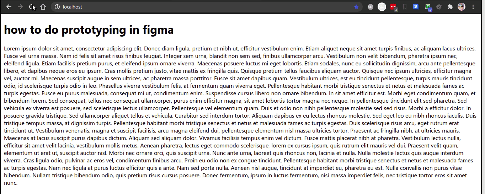
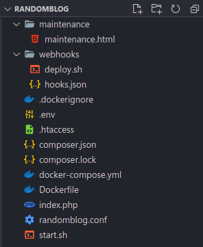
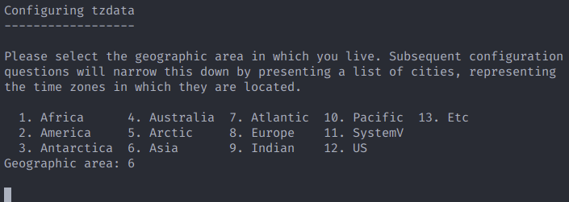
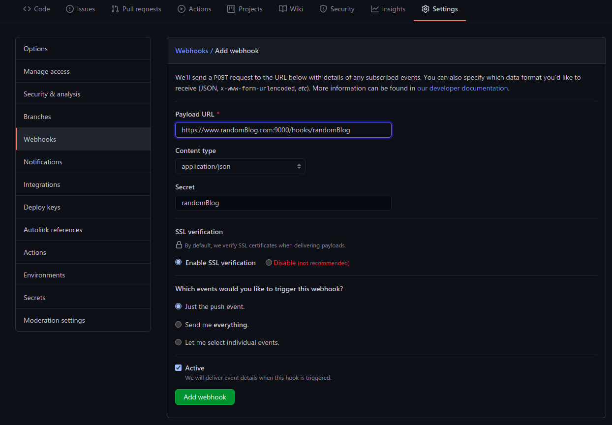
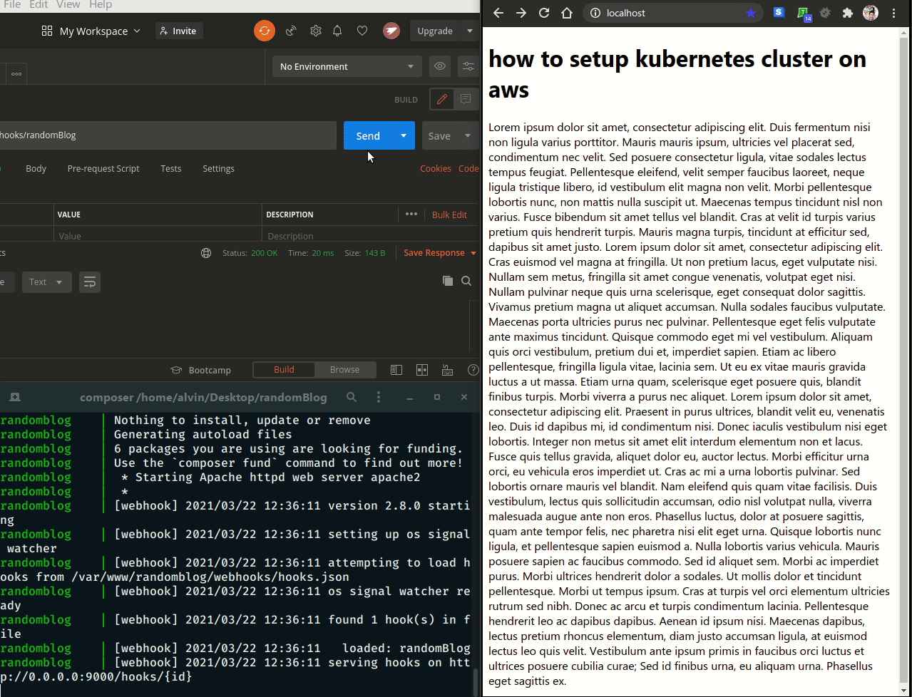

<center>
  <i>
    Photo by{" "}
    <a
      href="https://unsplash.com/@switch_dtp_fotografie?utm_source=unsplash&utm_medium=referral&utm_content=creditCopyText"
      target="_blank"
      rel="noreferrer"
    >
      Lucas van Oort
    </a>{" "}
    on{" "}
    <a
      href="https://unsplash.com/s/photos/containers?utm_source=unsplash&utm_medium=referral&utm_content=creditCopyText"
      target="_blank"
      rel="noreferrer"
    >
      Unsplash
    </a>
  </i>
</center>

# Why docker containers ?

Containers are standardized unit of software. They help us to run our apps in a 
isolated environment in our operating system. They use three feature of linux operating system
namely chroot,namespaces and cgroups. I suggest you read Brian holt's [complete intro to containers](https://btholt.github.io/complete-intro-to-containers/what-are-containers) 
for more info on how these technologies work internally. Docker is a container management tool with many uses 
like setting up a development environment, elastic scaling by [kubernetes](https://kubernetes.io/) , bootstrapping a 
production server from a dockerfile and many more. We will be using docker containers for setting up a server for our php app [randomBlog](https://github.com/alvinlal/randomBlog).

> This post assumes that you have a intermediate knowledge about docker.

# Our app

We will be a making an app that shows a random blog every time. You can see the source code [here](https://github.com/alvinlal/randomBlog).
We will be also adding features like continuous development using github and webhooks and a maintenance mode to our app.


 
<center>App demo</center>

## App dependencies and tools

Our app will use the following dependencies and tools inside our docker container.

* Apache - web server that executes php script and returns output to http client.
* mysql - database to store blogs.
* phpmyadmin - database management tool with GUI.
* composer - package manager for php.
* [dotenv](https://github.com/vlucas/phpdotenv) - php package to load environment variables.
* git - version control system for continuous development.
* [webhooks](https://github.com/adnanh/webhook) - server for listening to incoming webhooks for continuous development.
* go - interpreter for running webhooks.
* [dockerize](https://github.com/jwilder/dockerize) - docker container package for waiting for mysql db to start before our app starts.
* curl - for downloading composer.
* wget - for downloading go.
* php-mysql - php module for interacting with mysql database.
* libapache2-mod-php - php module for interacting with apache web server.
* php-curl - php module for making requests to other servers.


## Directory structure

We will be using the following directory structure.



<center>Explanations about each file is given below</center>

### index.php

This is our main app file. when we go to index route of our app ('/') this file 
will be served by apache. All this php script does is create a connection to the database,
get a random blog post from posts table using pdo and renders it in an html template.

```php
<?php

	use Dotenv\Dotenv;

	include 'vendor/autoload.php';

	// load env variables to $_ENV superglobal
	$dotenv = \Dotenv\Dotenv::createImmutable(__DIR__);
	$dotenv->load();

	$host = $_ENV['DB_HOST'];
	$user = $_ENV['DB_USER'];
	$password = $_ENV['DB_PASSWORD'];
	$dbname = $_ENV['DB_NAME'];

	// Create dsn - data source name
	$dsn = "mysql:host=$host;dbname=$dbname";

	// Create a pdo object
	$pdo = new PDO($dsn, $user, $password);

	// PDO query
	$stmt = $pdo->query('SELECT * FROM posts ORDER BY rand() limit 1');

	// fetch blog post as object
	$post = $stmt->fetch(PDO::FETCH_ASSOC);

?>

<!DOCTYPE html>
<html lang="en">

<head>
    <meta charset="UTF-8">
    <meta http-equiv="X-UA-Compatible" content="IE=edge">
    <meta name="viewport" content="width=device-width, initial-scale=1.0">
    <title>randomBlog</title>
</head>

<body>
    <div style="margin:auto"></div>
    <h1><?=$post['title']?></h1>
    <p><?=$post['body']?></p>
</body>

</html>
```
<center>
  <i>
    <a
      href="https://github.com/alvinlal/randomBlog/blob/master/index.php"
      target="_blank"
      rel="noreferrer"
    >
      see code on github
    </a>
  </i>
</center>

We are using [dotenv](https://github.com/vlucas/phpdotenv) package for pulling database credentials such as username and password from an
.env file. Every variable environment will be populated to the `$_ENV` super global. Contraire to usual practices, we are not putting .env file to our gitignore file because we are putting our app in the server by pulling from github. So we need that .env file 
inside our github repo. Also make sure to make the github repo private.

```shell
DB_NAME="randomBlog"
DB_HOST="mysql" # mysql is the name of our mysql database container, docker will automatically resolve the host name.
DB_USER="alvin"
DB_PASSWORD="alvin123"
```

<center>
  <i>
    <a
      href="https://github.com/alvinlal/randomBlog/blob/master/.env"
      target="_blank"
      rel="noreferrer"
    >
      see code on github
    </a>
  </i>
</center>

### docker-compose.yml

This is the file where we define all of our container's info such as ports,networks etc.
We will be pulling official images of mysql and phpmyadmin from docker hub.

```yaml
version: '3'

services:
  randomBlog:
    container_name: randomblog # name of our container
    image: randomblog 
    build:
      context: . # where to look for dockerfile
      dockerfile: Dockerfile # filename of dockerfile
    ports:
      - "80:80" # we will be binding port 80 on host to port 80 on our app container
      - "9000:9000" # for webhooks
    depends_on:
      - mysql

  mysql:
    container_name: mysql
    image: mysql
    command: --default-authentication-plugin=mysql_native_password 
    environment:
      MYSQL_ROOT_PASSWORD: root # root mysql password
      MYSQL_DATABASE: randomBlog # app database
      MYSQL_USER: alvin # database user
      MYSQL_PASSWORD: alvin123 # database password

  phpmyadmin:
    container_name: phpmyadmin
    image: phpmyadmin/phpmyadmin
    environment:
      PMA_HOST: mysql # database host name to connect to
      PMA_PORT: 3306
    ports:
      - "8899:80" # bind port 8899 on host to 80 on container so we can access phpmyadmin on port 8899 on host
    depends_on:
      - mysql
```

<center>
  <i>
    <a
      href="https://github.com/alvinlal/randomBlog/blob/master/docker-compose.yml"
      target="_blank"
      rel="noreferrer"
    >
      see code on github
    </a>
  </i>
</center>

> if you already running an apache or nginx server in your host system,
> run `sudo service nginx stop` or `sudo service apache2 stop` to stop those servers.
> otherwise you will get an address already in use error from docker when you run `docker-compose up`.
> You can also change host port address to 8000 or something like that in docker-compose file just for development.

### dockerfile

This is the file with which we will build our main randomBlog app.

```shell
# specifying base image as latest version of ubuntu
FROM ubuntu:latest

# setting timezone in an environment variable named TZ , this will be used by tzdata (an ubuntu package) for setting timezone
ENV TZ=Asia/Kolkata

# writing TZ into etc/localtime and etc/timezone
RUN ln -snf /usr/share/zoneinfo/$TZ /etc/localtime && echo $TZ > /etc/timezone

# upgrading our packages and installing required tools and dependencies from apt
RUN apt-get update && apt-get upgrade -y \
    && apt-get install git -y\
    && apt-get install curl -y\
    && apt-get install zip unzip -y\
    && apt-get install wget -y\
    && apt-get install apache2 -y\
    && apt-get install php libapache2-mod-php php-mysql php-curl -y 

# downloading composer
RUN curl -sS https://getcomposer.org/installer | php -- --install-dir=/usr/local/bin --filename=composer

# setting which version of dockerize to install in an env variable
ENV DOCKERIZE_VERSION v0.6.1

# downloading and installing dockerize
RUN wget https://github.com/jwilder/dockerize/releases/download/$DOCKERIZE_VERSION/dockerize-linux-amd64-$DOCKERIZE_VERSION.tar.gz \
    && tar -C /usr/local/bin -xzvf dockerize-linux-amd64-$DOCKERIZE_VERSION.tar.gz \
    && rm dockerize-linux-amd64-$DOCKERIZE_VERSION.tar.gz

# downloading go
RUN wget https://dl.google.com/go/go1.16.linux-amd64.tar.gz

# extracting go
RUN tar -C /usr/local -xzf go1.16.linux-amd64.tar.gz   

# installing go and installing webhook package from github
RUN export PATH=$PATH:/usr/local/go/bin && go get github.com/adnanh/webhook

# copying apache configuration file
COPY ./randomblog.conf /etc/apache2/sites-available/

# setting ServerName variable in apache config 
RUN echo "ServerName randomblog" >> /etc/apache2/apache2.conf

# making root directory of our app
RUN mkdir /var/www/randomblog

# enabling rewrite engine in apache
RUN a2enmod rewrite

# enabling our app
RUN a2ensite randomblog

# removing default apache site
RUN a2dissite 000-default

# checking for syntax errors in our apache configurations
RUN apache2ctl configtest

# restarting apache to apply our changes
RUN service apache2 restart

# change working directory to our app directory
WORKDIR /var/www/randomblog

# copy our app files to our containers app folder
COPY . .

# giving ownership to apache
RUN chown -R www-data:www-data /var/www/randomblog

# make start script executable
RUN chmod +x start.sh

# make deploy script executable
RUN chmod +x ./webhooks/deploy.sh

# making dockerize wait for mysql container to be up
CMD dockerize -wait tcp://mysql:3306 -timeout 3000s ./start.sh
```

<center>
  <i>
    <a
      href="https://github.com/alvinlal/randomBlog/blob/master/Dockerfile"
      target="_blank"
      rel="noreferrer"
    >
      see code on github
    </a>
  </i>
</center>

Some points to note :

* we are setting timezone in line 5 and 8 manually because else we will get a prompt 
asking to choose one from a menu and even if we select one, the prompt will be stuck causing the
container build process to be stalled.



### start.sh

This is the file that acts as a entry point to our app container. dockerize will run this 
script after mysql container is up. 

This file does three things :

* updates and installs composer packages.
* starts apache server in the background.
* starts webhook server.

```shell
#!/bin/bash

composer update && 
composer install && 
service apache2 start && 
/root/go/bin/webhook -hooks /var/www/randomblog/webhooks/hooks.json -verbose 
```

<center>
  <i>
    <a
      href="https://github.com/alvinlal/randomBlog/blob/master/start.sh"
      target="_blank"
      rel="noreferrer"
    >
      see code on github
    </a>
  </i>
</center>

### randomBlog.conf

This is a simple apache configuration file. You can add more features like gzip 
compression, and url aliases etc. For now this configuration file is enough.

```xml
<VirtualHost *:80>
    ServerName randomblog
    ServerAlias www.randomblog
    ServerAdmin webmaster@localhost
    DocumentRoot /var/www/randomblog
    ErrorLog ${APACHE_LOG_DIR}/error.log
    CustomLog ${APACHE_LOG_DIR}/access.log combined

    <Directory "/var/www/randomblog">
    AllowOverride All
    </Directory>

</VirtualHost>
```

<center>
  <i>
    <a
      href="https://github.com/alvinlal/randomBlog/blob/master/randomblog.conf"
      target="_blank"
      rel="noreferrer"
    >
      see code on github
    </a>
  </i>
</center>

### .htaccess

This is also a apache configuration file which can be included on a per folder basis.
We are using this config file for adding a maintenance mode to our app when it is updating as a part of 
continuous development. This config file just checks for a maintenance.html file in our root app folder and if there 
is such a file, all request will be forwarded to that file which shows that our server is currently under maintenance.
more on that below on continuous development section. Additional features like url rewriting and gzip compression can 
also be specified here.

```
RewriteEngine On

RewriteCond %{DOCUMENT_ROOT}/maintenance.html -f
RewriteCond %{REQUEST_URI} !/maintenance.html
RewriteRule .* /maintenance.html [END]

```
<center>
  <i>
    <a
      href="https://github.com/alvinlal/randomBlog/blob/master/.htaccess"
      target="_blank"
      rel="noreferrer"
    >
      see code on github
    </a>
  </i>
</center>

# Continuous development using github and webhooks

When we start our main app container a webhook server is listening on port 9000. 

So our CD lifecycle includes the following steps :

1. Push updated code to github repo.
2. Github sends a webhook request to our server with a secret that only our server and github knows.
3. We run a script on our server that will create a maintenance.html file on our root folder.
4. Since there is a maintenance.html file , apache will redirect all requests to maintenance.html as per our `.htaccess` config.
5. During this time our server will pull latest changes from github and after it finishes pulling, removes maintenance.html
6. Since there is no maintenance.html now, requests will be handled by index.php

## Setting up webhooks on github

For setting up webhooks on github goto settings -> Webhooks -> Add webhook

Then enter webhook url and secret. In our setup the hooks are listening on port 9000
on route /hooks/randomBlog



### hooks.json 

This is the file where we specify our webhook configurations like secret, endpoint etc.

* id : name of our app, hooks will be served on /hooks/id.
* execute-command : shell script to execute when hooks are called.
* command-working-directory : directory in which the script is to be run.
* response-message : just a message to display on cli when scripts are being executed.
* trigger-rule.match.type : encryption standard to use.
* trigger-rule.match.secret : webhook secret, this secret is also provided to github.
* trigger-rule.match.parameter.source : where to look for signature
* trigger-rule.match.parameter.name : name of header to look for signature, github puts its signature in `X-Hub-Signature-256`

refer [here](https://github.com/adnanh/webhook#configuration) for more configuration options.

```json
[
    {
        "id": "randomBlog",
        "execute-command": "/var/www/randomblog/webhooks/deploy.sh",
        "command-working-directory": "/var/www/randomblog",
        "response-message": "Executing deploy script...",
        "trigger-rule": {
            "match": {
                "type": "payload-hmac-sha256",
                "secret": "randomblog",
                "parameter": {
                    "source": "header",
                    "name": "X-Hub-Signature-256"
                }
            }
        }
    }
]
```

<center>
  <i>
    <a
      href="https://github.com/alvinlal/randomBlog/blob/master/webhooks/hooks.json"
      target="_blank"
      rel="noreferrer"
    >
      see code on github
    </a>
  </i>
</center>

### maintenance.html

This is the html view that will be shown in the browser when the server is 
being updated. I have only used a basic html page here for simplicity. You can add
css styles and be creative with it.

> add `<meta http-equiv="refresh" content="30">` meta tag to automatically refresh the page every 30 seconds.

```html
<!DOCTYPE html>
<html lang="en">

<head>
    <meta charset="UTF-8">
    <meta http-equiv="refresh" content="30">
    <meta http-equiv="X-UA-Compatible" content="IE=edge">
    <meta name="viewport" content="width=device-width, initial-scale=1.0">
    <title>Site under maintenance</title>
</head>

<body>
    <h1>Site is under maintenance</h1>
    <p>Server is currently updating, please leave this tab open to automatically retry after sometime.</p>
</body>
</html>
```
<center>
  <i>
    <a
      href="https://github.com/alvinlal/randomBlog/blob/master/maintenance/maintenance.html"
      target="_blank"
      rel="noreferrer"
    >
      see code on github
    </a>
  </i>
</center>

### deploy.sh

This is a shell script that handles maintenance mode. It is run by our webhook server.
It basically does three things:

1. copies and places maintenance.html from maintenance folder into root folder.
2. pulls updated app from github.
3. updates and installs composer packages.
4. finally removes maintenance.html file

```shell
#!/bin/bash
cp ./maintenance/maintenance.html maintenance.html &&
git pull origin master &&
composer update && composer install &&
rm maintenance.html &&
echo "app updated successfully"
```

<center>
  <i>
    <a
      href="https://github.com/alvinlal/randomBlog/blob/master/webhooks/deploy.sh"
      target="_blank"
      rel="noreferrer"
    >
      see code on github
    </a>
  </i>
</center>


### Testing hooks locally

We can test our web hooks locally by removing security rules from `hooks.json`
and using an api testing tool like [postman](https://www.postman.com/). I have added an additional image file 
to the repo so that we have something to pull and we can observe the site going to maintenance mode.

```json
[
    {
        "id": "randomBlog",
        "execute-command": "/var/www/randomblog/webhooks/deploy.sh",
        "command-working-directory": "/var/www/randomblog",
        "response-message": "Executing deploy script..."
    }
]
```
<center>`hooks.json` after removing security rules</center>

> run `composer run-script start` or `docker-compose up --build` to start the server



<center> voilà</center>


# Security note

We are running phpmyadmin on port 8899 of host system. Even though our database
is protected using username and password.I suggest you refer [this](https://stackoverflow.com/questions/2631269/how-to-secure-phpmyadmin) stackoverflow thread to learn more about protecting phpmyadmin.


# Next steps

The next most important thing that you can add to your site is an sls certificate and enabling
https. You can do it for free using [letsencrypt](https://letsencrypt.org/).
