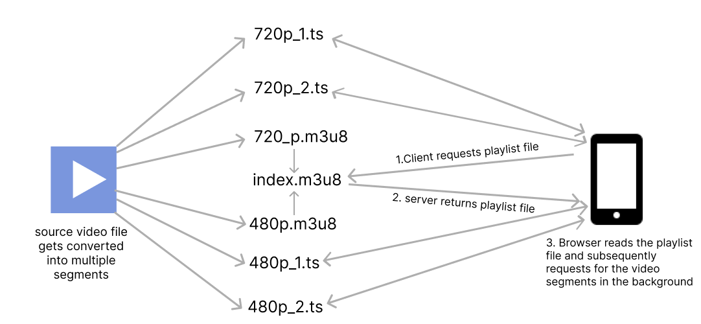
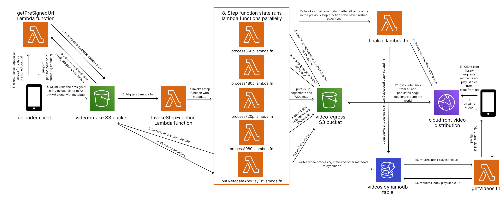

<center>
  <i>
    Photo by{" "}
    <a
      href="https://www.pexels.com/@ivan-cujic-20495/"
      target="_blank"
      rel="noreferrer"
    >
      Ivan Cujic
    </a>{" "}
    on{" "}
    <a
      href="https://www.pexels.com/photo/cloud-in-sky-and-building-109479/"
      target="_blank"
      rel="noreferrer"
    >
      Pexels
    </a>
  </i>
</center>

# Introduction

Streaming video through the web has always been an interesting problem.   Cisco [predicted](https://www.cisco.com/c/dam/m/en_us/solutions/service-provider/vni-forecast-highlights/pdf/Global_2021_Forecast_Highlights.pdf) that video traffic will contribute to 80% of all internet traffic in 2021. Nearly 1 billion hours of video are streamed on youtube every day and  Platforms like Netflix and Amazon Prime Video heavily rely on video streaming to deliver their entertainment platform. While traditional streaming methods used a single video file and html5 video player, today's techniques are much more complex and efficient. Adaptive Bitrate streaming is the most commonly used technique today to stream video over the web. 


## Adaptive Bitrate Streaming (ABR)

ABR is a technique used for streaming videos over HTTP where the source content is encoded at multiple bit rates and the client can automatically or manually switch to different qualities based on available network bandwidth. Streaming giants like Youtube and Netflix use ABR to adapt to their client's network bandwidth and automatically switch to the right video quality. When a video is uploaded to youtube multiple copies of the same video are made, each with different bitrates and the client can manually or automatically switch between different bitrates. Bitrates refer to the number of bits a video outputs per second. The more the bitrate, the more detailed the video will be. Several streaming protocols implement Adaptive Bitrate Streaming. Some of them are:-

- HTTP Live Streaming (HLS)
- Dynamic Adaptive Streaming over HTTP (DASH)
- Microsoft Smooth Streaming (MSS)
- Adobe HTTP Dynamic Streaming (HDS)

Most ABR protocols work by dividing the video file into multiple segments of different bitrates and using a manifest file to tell the client where to find each segment. The reason the source video is divided into multiple segments of different bitrates instead of a single file of different bitrates is that it will be much easier to handle the video on the client-side. In this tutorial, we will be using HTTP Live Streaming (HLS) protocol to make videos suitable for ABR streaming. Before jumping to the tutorial let's get to know more about HLS. If you want to directly jump to the tutorial, click [here](#tutorial).

## HTTP Live Streaming (HLS)

HTTP Live Streaming (HLS) is an HTTP-based media streaming protocol developed by Apple. It was initially developed for video streaming on iPhone and is currently supported by many browsers. The way HLS works is by converting the source video into a configurable number of segment files with an extension of '.ts' and using an m3u8 file as a manifest file. This file is also called a playlist file. HLS has support for live streaming and ad injection.


### Playlist files and segments
An m3u8 file is an extended version of an m3u file which is a plain text file format originally created to organize mp3 playlists. It is saved with the m3u8 extension and is composed of a set of tags. A hls segment contains a part of the source video and has an extension of ts. The playlist file contains metadata and URL to the different segments. The recommended duration for a segment is between 4 to 5 seconds.

```
// 720p.m3u8
 #EXTM3U                 // all hls playlist files must start with this tag
 #EXT-X-VERSION:3        // version
 #EXT-X-TARGETDURATION:5 // maximum duration of a segment
 #EXT-X-MEDIA-SEQUENCE:0 // indicates the sequence of the first url, usually 0
 #EXT-X-PLAYLIST-TYPE:VOD // stands for video on demand, used to differentiate from a live stream
 #EXTINF:4.804800,       // duration of the segment file below
 720p_0.ts               // this is the segment url, since we are putting every file in a single folder this is relative to the folder where the playlist file resides. It can also be absolute like https://yourcdn.com/videofolder/720p_0.ts
 #EXTINF:3.203200,
720p_1.ts
#EXTINF:4.804800,
720p_2.ts
#EXTINF:3.203200,
720p_3.ts
#EXTINF:4.804800,
720p_4.ts
#EXTINF:3.203200,
720p_5.ts
#EXTINF:4.337667,
720p_6.ts
#EXT-X-ENDLIST // indicates that no more media files will be added to the playlist file
```

<center>
    Example playlist file for segments with suitable bitrate for 720p
</center>

> Dynamic Adaptive Streaming over HTTP (DASH) uses a similar configuration with .m4s extension for the segments and XML for the manifest file

For adaptive bitrate streaming, The source video file needs to be converted to segments of all the bitrates for different resolutions like 360p, 480p, 720p and 1080p and for each bitrate, we will create a separate playlist file linking its corresponding segments and finally link all the playlist file using a single index.m3u8 file which will be read by the browser. We will be putting all the playlist files and segments for a particular video under a single folder. This is only one of the many ways by which you can organize the playlist files and segments. However you organize your segments and playlists, the URL field of every segment defined in the playlist file should be reachable by the client.

In the case of a live stream, the segments should be dynamically created and the playlist file should be updated accordingly.



<center>
    Working of HLS
</center>


```
// index.m3u8
 #EXTM3U
 #EXT-X-VERSION:3
 #EXT-X-STREAM-INF:BANDWIDTH=800000,RESOLUTION=640x360 // maximum bandwidth and resolution required in bits per second for the client to play the playlist below. 
 360p.m3u8     // playlist file containing reference to segments for above bandwidth and resolution, can also be absolute like https://yourcdn.com/videofolder/360p.m3u8
 #EXT-X-STREAM-INF:BANDWIDTH=1400000,RESOLUTION=842x480
 480p.m3u8
 #EXT-X-STREAM-INF:BANDWIDTH=2800000,RESOLUTION=1280x720
 720p.m3u8
#EXT-X-STREAM-INF:BANDWIDTH=5000000,RESOLUTION=1920x1080
1080p.m3u8
```

<center>
    index.m3u8 which links to all other m3u8 files for different resolutions
</center>


We can use [ffmpeg](https://ffmpeg.org/) to encode and generate the segments and playlist files. FFmpeg supports HLS encoding out of the box and will automatically set the tags and create the playlist files for us. For a full list of supported tags, refer to [Apple's documentation](https://developer.apple.com/documentation/http_live_streaming/example_playlists_for_http_live_streaming/video_on_demand_playlist_construction) 

## HLS on the browser

As of the time of writing, HLS is natively supported only on a [few](https://caniuse.com/?search=hls) browsers. Mainstream browsers like chrome and firefox are yet to add native support for HLS playback. But this doesn't mean that we can't play HLS on those browsers, HLS can be used with a javascript library in browsers that doesn't support it natively as long as they support [Media Source Extensions](https://developer.mozilla.org/en-US/docs/Web/API/Media_Source_Extensions_API)(MSE). Media Source Extensions is a standard javascript API that allows customization of the input to media elements such as the html5 `<video>` tag using the `MediaSource` object. The MediaSource object contains references to multiple `SourceBuffer` objects that represent the different chunks of media that make up the entire stream. Hence, the client can progressively fetch the different segments using the native `fetch` API and fill the different SourceBuffers for different bitrates and finally, this SourceBuffer is fed into the video element using MediaSourceExtension Object for playback. The quality is changed by switching between different SourceBuffers. All this seems like a lot of work and thankfully there are lots of battle-tested libraries out there that will do all of the work for us. Popular libraries include [videojs](https://videojs.com/), Google's [shakaplayer](https://github.com/shaka-project/shaka-player) and [hls.js](https://github.com/video-dev/hls.js/).

<h1 id="tutorial">Video processing pipeline using AWS</h1>

Now that we have an idea about what HLS is, Let's implement a video processing pipeline using AWS that takes in a source video, makes it suitable for HLS streaming and streams it to users using above mentioned videojs library.

AWS service we will be using:-

1. S3 - to store source video and output video
2. Lambda - to convert the video into different formats using FFmpeg
3. Step Functions - to coordinate between lambda functions
4. DynamoDB - to store video metadata
5. Cloudfront - to distribute video to users

We will be also using [serverless framework](https://www.serverless.com/) for deploying the infrastructure, [FFmpeg](https://ffmpeg.org/) to convert video into HLS, [Nodejs](https://nodejs.org/en/) to write lambda functions and [videojs](https://videojs.com/) on the client side.

## What we will be making

You can find the github repository [here](https://github.com/alvinlal/blogRepos/tree/master/04-serverless-video-processing-using-aws-and-hls)


## AWS Architecture



<center>
    Architecture diagram of AWS infrastructure. Each step in the diagram is explained in detail below.
</center>

The flow of logic of our app is as follows:-

### 1. Client makes request to getPreSignedUrl lambda function

We can use a feature of AWS s3 called [presigned urls](https://docs.aws.amazon.com/AmazonS3/latest/userguide/PresignedUrlUploadObject.html) to directly upload our source video file to s3. You can use pre-signed URLs to access a private object or upload objects to a private bucket. The client requests the getPreSignedUrl lambda function to get an authenticated URL from s3. The key of the video object is set by the getPreSignedUrl lambda function using the crypto module in nodejs. This key will be used to uniquely identify a video. Additional metadata sent from the client can be attached as key-value pairs in the s3 object. Do note that getPreSignedUrl needs `s3:PutObject` permission to get a pre-signed post url.

**getPreSignedUrl.js lambda function**

```javascript
const S3 = require('aws-sdk/clients/s3'); // no need to install aws-sdk, available without installing for all nodejs lambda functions
const crypto = require('crypto');

const s3 = new S3({
  region: 'ap-south-1',
});

const createPresignedUrl = metaData => { // metadata can contain additional info send from the client
  const params = {
    Fields: {
      key: crypto.randomBytes(8).toString('hex'), // returns a random string
      'x-amz-meta-title': metaData.title, // setting object metadata, has to be in the form x-amz-meta-yourmetadatakey
    },
    Conditions: [
      ['starts-with', '$Content-Type', 'video/'], // accept only videos
      ['content-length-range', 0, 500000000], // max size in bytes, 500mb
    ],
    Expires: 60, // url expires after 60 seconds
    Bucket: 'video-intake',
  };
  return new Promise((resolve, reject) => {
    s3.createPresignedPost(params, (err, data) => {
      // we have to promisify s3.createPresignedPost because it does not have a .promise method like other aws sdk methods
      if (err) {
        reject(err);
        return;
      }
      resolve(data);
    });
  });
};

const getPreSignedUrl = async event => {
  try {
    const data = await createPresignedUrl(JSON.parse(event.body));
    return {
      statusCode: 200,
      body: JSON.stringify({
        data,
      }),
    };
  } catch (err) {
    return {
      statusCode: 500,
      body: JSON.stringify({
        message: 'Internal server error',
      }),
    };
  }
};

module.exports = {
  handler: getPreSignedUrl,
};

```

<center>
  <i>
    <a
      href="https://github.com/alvinlal/blogRepos/blob/master/04-serverless-video-processing-using-aws-and-hls/functions/getPreSignedUrl.js"
      target="_blank"
      rel="noreferrer"
    >
      see code on github
    </a>
  </i>
</center>

on the client-side, we need to pack our video file along with the authentication fields returned to us by getPreSignedUrl lambda fn using [formData](https://developer.mozilla.org/en-US/docs/Web/API/FormData) object and make a post request to s3.

**app.js**

```javascript
async function handleSubmit(e) { // runs when you click upload button
  e.preventDefault();

  if (!file.files.length) {
    alert('please select a file');
    return;
  }

  if (!title.value) {
    alert('please enter a title');
    return;
  }

  try {
    const {
      data: { url, fields },
    } = await fetch('https://ve2odyhnhg.execute-api.ap-south-1.amazonaws.com/getpresignedurl', {// your url might be different from this, replace it with api gateway endpoint of your lambda function
      method: 'POST',
      headers: {
        'Content-Type': 'application/json',
        Accept: 'application/json',
      },
      body: JSON.stringify({ title: title.value }), // send other metadata you want here
    }).then(res => res.json());

    const data = {
      bucket: 'video-intake',
      ...fields,
      'Content-Type': file.files[0].type,
      file: file.files[0],
    };

    const formData = new FormData();

    for (const name in data) {
      formData.append(name, data[name]);
    }

    uploadStatus.textContent = 'uploading...';
    await fetch(url, {
      method: 'POST',
      body: formData,
    });
    uploadStatus.textContent = 'successfully uploaded';
  } catch (err) {
    console.error(err);
  }
}
```

<center>
  <i>
    <a
      href="https://github.com/alvinlal/blogRepos/blob/master/04-serverless-video-processing-using-aws-and-hls/client/js/app.js#L8-L55"
      target="_blank"
      rel="noreferrer"
    >
      see code on github
    </a>
  </i>
</center>

### 2. S3 upload triggers stepfunction

The video-intake s3 bucket is configured to invoke the invokeStepFunction Lambda function whenever a new object is uploaded to the bucket through [event notifications](https://docs.aws.amazon.com/AmazonS3/latest/userguide/NotificationHowTo.html) which inturns invoke the step function. We are using an extra lambda function to invoke the step function because as of writing s3 event notifications only support invoking lambda functions, SQS and SNS. You can also use [EventBridge](https://docs.aws.amazon.com/eventbridge/latest/userguide/eb-what-is.html) to trigger other AWS services from s3.


**invokeStepFunction.js lambda function**

```javascript
const AWS = require('aws-sdk');

AWS.config.update({
  region: 'ap-south-1',
});

const stepFunctions = new AWS.StepFunctions();

const invokeStepFunction = (event, context, callback) => {
  const id = event.Records[0].s3.object.key; // event object contains payload from s3 trigger
  try {
    const stateMachineParams = {
      stateMachineArn: process.env.STEP_FUNCTION_ARN,
      input: JSON.stringify({ id }), // input to each lambda function in the parallel step function state
    };
    stepFunctions.startExecution(stateMachineParams, (err, data) => { // starts step function execution
      if (err) {
        console.error(err);
        const response = {
          statusCode: 500,
          body: JSON.stringify({
            message: 'There was an error',
          }),
        };
        callback(null, response);
      } else {
        console.log(data);
        const response = {
          statusCode: 200,
          body: JSON.stringify({
            message: 'Step function worked',
          }),
        };
        callback(null, response);
      }
    });
  } catch (err) {
    console.error(err);
  }
};

module.exports = {
  handler: invokeStepFunction,
};


```

<center>
  <i>
    <a
      href="https://github.com/alvinlal/blogRepos/blob/master/04-serverless-video-processing-using-aws-and-hls/functions/invokeStepFunction.js"
      target="_blank"
      rel="noreferrer"
    >
      see code on github
    </a>
  </i>
</center>

### 3. Step function execution

It is inside the step function where the actual video processing tasks take place. We are using a [parallel state](https://docs.aws.amazon.com/step-functions/latest/dg/amazon-states-language-parallel-state.html) to execute our lambda functions parallelly. The first 4 lambda functions are responsible for taking the source video file from s3 and converting it into corresponding bitrates. Inside the Lambda function, we are using the [node-fluent-ffmpeg](https://github.com/fluent-ffmpeg/node-fluent-ffmpeg) package to convert the source video into a particular bitrate and make it suitable for HLS streaming by dividing it into different segments. The output of the video conversion process is uploaded to the `video-egress` bucket.

**process360p lambda function**

```javascript
const S3 = require('aws-sdk/clients/s3');
const ffmpeg = require('fluent-ffmpeg');
const fs = require('fs');

const s3 = new S3({
  region: 'ap-south-1',
});

const process360p = event => {
  const id = event.id; // data from the invokeStepFunction lamda function
  const params = { Bucket: 'video-intake', Key: id };
  const readStream = s3.getObject(params).createReadStream(); // create s3 readStream
  var totalTime;

  fs.mkdirSync(`/tmp/${id}`);

  ffmpeg(readStream)
    .on('start', () => {
      console.log(`transcoding ${id} to 360p`);
    })
    .on('error', (err, stdout, stderr) => {
      console.log('stderr:', stderr);
      console.error(err);
    })
    .on('end', async () => {
      const fileUploadPromises = fs.readdirSync(`/tmp/${id}`).map(file => {
        let params = { Bucket: 'video-egress', Key: `${id}/${file}`, Body: fs.readFileSync(`/tmp/${id}/${file}`) };
        console.log(`uploading ${file} to s3`);
        return s3.putObject(params).promise();
      });
      await Promise.all(fileUploadPromises); // upload output to s3
      await fs.rmdirSync(`/tmp/${id}`, { recursive: true });
      console.log(`tmp is deleted!`);
    })
    .on('codecData', data => {
      totalTime = parseInt(data.duration.replace(/:/g, ''));
    })
    .on('progress', progress => {
      const time = parseInt(progress.timemark.replace(/:/g, ''));
      const percent = Math.ceil((time / totalTime) * 100);
      console.log(`progress :- ${percent}%`);
    })
    .outputOptions(['-vf scale=w=640:h=360', '-c:a aac', '-ar 48000', '-b:a 96k', '-c:v h264', '-profile:v main', '-crf 20', '-g 48', '-keyint_min 48', '-sc_threshold 0', '-b:v 800k', '-maxrate 856k', '-bufsize 1200k', '-f hls', '-hls_time 4', '-hls_playlist_type vod', `-hls_segment_filename /tmp/${id}/360p_%d.ts`])
    .output(`/tmp/${id}/360p.m3u8`) // output files are temporarily stored in tmp directory
    .run();
};

module.exports = {
  handler: process360p,
};

```

<center>
  <i>
    <a
      href="https://github.com/alvinlal/blogRepos/blob/master/04-serverless-video-processing-using-aws-and-hls/functions/process360p.js"
      target="_blank"
      rel="noreferrer"
    >
      see code on github
    </a>
  </i>
</center>

here we are using nodejs streams to stream the source video file from s3 to the fluent-ffmpeg library and temporarily storing the output data on lambda's 
[temp storage](https://aws.amazon.com/blogs/compute/choosing-between-aws-lambda-data-storage-options-in-web-apps/). After finishing the conversion process, it is uploaded to another s3 bucket (video-egress)

> We are using [lambda layers](https://docs.aws.amazon.com/lambda/latest/dg/configuration-layers.html) to provide the lambda runtimes with ffmpeg binaries and fluent-ffmpeg library.

> In a production environment, you may want to include [error handling](https://docs.aws.amazon.com/step-functions/latest/dg/concepts-error-handling.html) and [retry](https://aws.amazon.com/blogs/developer/handling-errors-retries-and-adding-alerting-to-step-function-state-machine-executions/) mechanisms inside step-functions if any of the lambda functions fails for any reason.

> Also note that in step functions, the return value of a function will be input to the next step function. That's how we pass the id of the video around lambda functions. The input can be accessed inside the event parameter of a lambda function.

### FFmpeg options

We can provide configuration flags to ffmpeg using fluent-ffmpeg's outputOptions method. The recommended configurations are taken from [here](https://docs.peer5.com/guides/production-ready-hls-vod/#how-to-choose-the-right-bitrate)

1. `-vf` scaling factor used to set the output resolution
2. `-c:a aac` sets the audio codec to aac
3. `-ar 48000` sets the audio sampling rate to 48khz
4. `-b:a 96k` sets the audio bitrate to 96kbits/s
5. `-c:v h264` sets the video codec to h264
5. `-profile:v main` sets  h264 profile to main - this means support in modern devices
6. `-crf 20` constant rate factor, overall quality
7. `-g 48 -keyint_min 48` create [key-frames](https://blog.video.ibm.com/streaming-video-tips/keyframes-interframe-video-compression/#:~:text=and%20b%2Dframes.-,What%20is%20a%20keyframe%3F,or%20how%20it's%20being%20streamed.) every 48 frames
8. `-sc_threshold 0` don't create keyframes on scene change - only according to -g
9. `-b:v 800k` sets video bitrate to 800kbits/s
10. `-maxrate 856k` maximum video bitrate allowed
11. `-f hls` sets the encoding type to hls
12. `-hls_time 4` sets the duration of hls segment
13. `-hls_playlist_type vod` sets hls playlist type to video on demand
14. `-hls_segment_filename /tmp/${id}/360p_%d.ts` outputs each segment to tmp/id. Id is the key of the video which uniquely identifies a video. '%d' is an iterator that starts at 0. 

the `output` function of the fluent-ffmpeg library accepts a path to where the playlist file should be saved.

[process480p](https://github.com/alvinlal/blogRepos/blob/master/04-serverless-video-processing-using-aws-and-hls/functions/process480p.js),[process720p](https://github.com/alvinlal/blogRepos/blob/master/04-serverless-video-processing-using-aws-and-hls/functions/process720p.js) and [process1080p](https://github.com/alvinlal/blogRepos/blob/master/04-serverless-video-processing-using-aws-and-hls/functions/process1080p.js) lambda functions is very similar to the process360p. The only difference is in the resolution, audio and video bitrates provided to ffmpeg configuration. For a full list to recommended bitrates for each resolution, check [here](https://docs.peer5.com/guides/production-ready-hls-vod/#how-to-choose-the-right-bitrate).

Finally, the putMetadataAndPlaylist lambda function gets object metadata from the s3 bucket and writes to dynamodb table. The object metadata contains a status field which will be set by the function as 'processing'. This function also writes the `index.m3u8` file to the output bucket.

**putMetadataAndPlaylist lambda function**

```javascript
const AWS = require('aws-sdk');

AWS.config.update({
  region: 'ap-south-1',
});

const s3 = new AWS.S3();
const dynamoDb = new AWS.DynamoDB.DocumentClient();

const putMetadataAndPlaylist = async event => {
  const id = event.id;
  try {
    const s3Params = {
      Bucket: 'video-intake',
      Key: id,
    };

    const data = await s3.headObject(s3Params).promise(); // gets metadata from s3

    const dynamoParams = {
      TableName: 'videos',
      Item: {
        id,
        title: data.Metadata.title,
        url: `https://${process.env.CLOUDFRONT_DOMAIN}/${id}/index.m3u8`,
        status: 'processing',
      },
    };

    await dynamoDb.put(dynamoParams).promise(); // writes metadata to dynamoDb
    console.log('Successfully written metadata to dynamoDb');

    const content = `#EXTM3U
#EXT-X-VERSION:3
#EXT-X-STREAM-INF:BANDWIDTH=800000,RESOLUTION=640x360
360p.m3u8
#EXT-X-STREAM-INF:BANDWIDTH=1400000,RESOLUTION=842x480
480p.m3u8
#EXT-X-STREAM-INF:BANDWIDTH=2800000,RESOLUTION=1280x720
720p.m3u8
#EXT-X-STREAM-INF:BANDWIDTH=5000000,RESOLUTION=1920x1080
1080p.m3u8`;

    await s3.putObject({ Bucket: 'video-egress', Key: `${id}/index.m3u8`, Body: content }).promise(); // writes index.m3u8 to output bucket

    console.log('Successfully written index playlist to s3');

    return { id };
  } catch (err) {
    console.error(err);
  }
};

module.exports = {
  handler: putMetadataAndPlaylist,
};


```

<center>
  <i>
    <a
      href="https://github.com/alvinlal/blogRepos/blob/master/04-serverless-video-processing-using-aws-and-hls/functions/putMetadataAndPlaylist.js"
      target="_blank"
      rel="noreferrer"
    >
      see code on github
    </a>
  </i>
</center>

### 4. The finalize lambda function
 
The finalize lambda function is the last task of the step function and will only be executed after the parallel task has finished executing. It does two things.

  1. Change the status to `finished` in video metadata inside dynamo DB table
  2. Invalidate CloudFront distribution

**finalize lambda function**

```javascript
const AWS = require('aws-sdk');

AWS.config.update({
  region: 'ap-south-1',
});

const dynamoDb = new AWS.DynamoDB.DocumentClient();
const cloudfront = new AWS.CloudFront();

const finalize = async event => {
  try {
    const id = event[4].id;

    const dynamoParams = {
      TableName: 'videos',
      Key: {
        id,
      },
      UpdateExpression: 'set #videoStatus = :x',
      ExpressionAttributeNames: { '#videoStatus': 'status' }, // because status is reserved keyword in dynamoDb
      ExpressionAttributeValues: {
        ':x': 'finished',
      },
    };

    await dynamoDb.update(dynamoParams).promise(); // updates status of the video
    console.log('Successfully updated video status');

    const cloudfrontParams = {
      DistributionId: process.env.CLOUDFRONT_ID,
      InvalidationBatch: {
        CallerReference: Date.now().toString(),
        Paths: {
          Quantity: 1,
          Items: [`/${id}/*`],
        },
      },
    };

    await cloudfront.createInvalidation(cloudfrontParams).promise(); // invalidates cloudfront distribution
    console.log('cloudfront invalidated');
  } catch (err) {
    console.error(err);
  }
};

module.exports = {
  handler: finalize,
};
```

<center>
  <i>
    <a
      href="https://github.com/alvinlal/blogRepos/blob/master/04-serverless-video-processing-using-aws-and-hls/functions/finalize.js"
      target="_blank"
      rel="noreferrer"
    >
      see code on github
    </a>
  </i>
</center>

At this point, the video is ready to be streamed by the client using videojs library.

**index.html**

```html
<!DOCTYPE html>
<html lang="en">

<head>
    <meta charset="UTF-8">
    <meta http-equiv="X-UA-Compatible" content="IE=edge">
    <meta name="viewport" content="width=device-width, initial-scale=1.0">
    <link href="https://vjs.zencdn.net/7.18.1/video-js.css" rel="stylesheet" />
    <link href="./css/style.css" rel="stylesheet" />
    <title>Serverless video processing using aws and hls</title>
</head>

<body>
    <div class="upload">
        <form method="post" style="margin-bottom: 100px;">
            <label>video title:<input type="text" name="title" /></label>
            <input type="file" name="file" accept="video/*" />
            <p id="upload-status"></p>
            <button type="submit">upload</button>
        </form>
    </div>
    <div id="videos-container">
        <!-- call getVideos lambda function and insert videos using js-->
    </div>
</body>
<script src="https://vjs.zencdn.net/7.18.1/video.min.js"></script>
<script src="js/videojs-contrib-quality-levels.min.js"></script>
<script src="js/videojs-hls-quality-selector.min.js"></script>
<script src="js/app.js"></script>

</html>
```

<center>
  <i>
    <a
      href="https://github.com/alvinlal/blogRepos/blob/master/04-serverless-video-processing-using-aws-and-hls/client/index.html"
      target="_blank"
      rel="noreferrer"
    >
      see code on github
    </a>
  </i>
</center>

**app.js**

```javascript
// elements
const form = document.querySelector('form');
const file = document.querySelector('input[name="file"]');
const title = document.querySelector('input[name="title"]');
const videosContainer = document.getElementById('videos-container');
const uploadStatus = document.getElementById('upload-status');
// functions
async function handleSubmit(e) {
  // runs when you click upload button
  e.preventDefault();

  if (!file.files.length) {
    alert('please select a file');
    return;
  }

  if (!title.value) {
    alert('please enter a title');
    return;
  }

  try {
    const {
      data: { url, fields },
    } = await fetch('https://ve2odyhnhg.execute-api.ap-south-1.amazonaws.com/getpresignedurl', {
      // your url might be different from this, replace it with api gateway endpoint of your lambda function
      method: 'POST',
      headers: {
        'Content-Type': 'application/json',
        Accept: 'application/json',
      },
      body: JSON.stringify({ title: title.value }), // send other metadata you want here
    }).then(res => res.json());

    const data = {
      bucket: 'video-intake',
      ...fields,
      'Content-Type': file.files[0].type,
      file: file.files[0],
    };

    const formData = new FormData();

    for (const name in data) {
      formData.append(name, data[name]);
    }

    uploadStatus.textContent = 'uploading...';
    await fetch(url, {
      method: 'POST',
      body: formData,
    });
    uploadStatus.textContent = 'successfully uploaded';
  } catch (err) {
    console.error(err);
  }
}

async function displayAllVideos() {
  const videos = await fetch('https://ve2odyhnhg.execute-api.ap-south-1.amazonaws.com/getVideos').then(res => res.json());

  console.log(videos);

  videos.forEach(video => {
    var html;
    if (video.status === 'processing') {
      html = `<div class="video">
      <h3 class="title">${video.title}</h3>
      <div class="spinner-container">
      <div id="loading"></div>
      <p>Processing...</p>
      </div>
      </div>`;
      videosContainer.insertAdjacentHTML('beforeend', html);
    } else {
      html = `<div class="video">
      <h3 class="title">${video.title}</h3>
      <video id="video-${video.id}" class="video-js" data-setup='{}' controls width="500" height="300">
    <source src="${video.url}" type="application/x-mpegURL">
</video>
      </div>`;
      videosContainer.insertAdjacentHTML('beforeend', html);
      const player = videojs(`video-${video.id}`);
      player.hlsQualitySelector({
        displayCurrentQuality: true,
      });
    }
  });
}

// listeners
form.addEventListener('submit', e => handleSubmit(e));

//function calls
displayAllVideos();

```

<center>
  <i>
    <a
      href="https://github.com/alvinlal/blogRepos/blob/master/04-serverless-video-processing-using-aws-and-hls/client/js/app.js"
      target="_blank"
      rel="noreferrer"
    >
      see code on github
    </a>
  </i>
</center>

> The source type of the  `<source>` tag should be application/x-mpegURL for HLS streaming

Also note that as of writing, videojs do not provide the functionality to change streaming quality out of the box and we have to use [videojs-contrib-quality-levels](https://github.com/videojs/videojs-contrib-quality-levels) and [videojs-hls-quality-selector](https://github.com/chrisboustead/videojs-hls-quality-selector) plugins.

serverless.yaml configuration file for this architecture can be found [here](https://github.com/alvinlal/blogRepos/blob/master/04-serverless-video-processing-using-aws-and-hls/serverless.yml). clone [this](https://github.com/alvinlal/blogRepos/tree/master/04-serverless-video-processing-using-aws-and-hls) repo and run `sls deploy` to test it out.

# Limitations of this approach

Even though this approach has less overhead due to the serverless nature, there are certain Limitations.

 1. As of writing, the maximum timeout duration of a lambda function is 15 mins. So the video processing jobs have to finish within 15 minutes.
 2. As of writing, the maximum memory that can be allocated to a lambda function is 10gb and vcpu cores would be allocated proportional to the memory. for example, a lambda function with 10gb of memory allocated will have 6 vcpu cores. For small to medium workloads, 6 vcpu's is enough to finish the job within 15 minutes. But for high-resolution lengthy videos, the lambda function may timeout.
 
**I hope you get some idea about video processing and streaming on the web through this post and if you have any doubts or queries about the implementation details of the architecture, drop me a comment below.**
