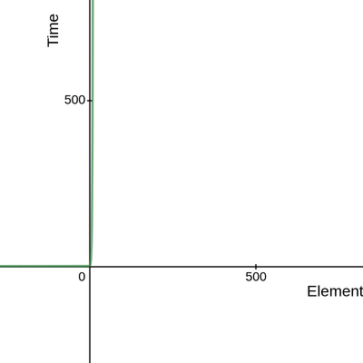

<center>
  <i>
    Photo by{" "}
    <a
      href="https://unsplash.com/@swimstaralex?utm_source=unsplash&amp;utm_medium=referral&amp;utm_content=creditCopyText"
      target="_blank"
      rel="noreferrer"
    >
      Alexander Sinn
    </a>{" "}
    on{" "}
    <a
      href="https://unsplash.com/s/photos/big-data?utm_source=unsplash&amp;utm_medium=referral&amp;utm_content=creditCopyText"
      target="_blank"
      rel="noreferrer"
    >
      Unsplash
    </a>
  </i>
</center>

# Big O everywhere

If you are from a computer science background, chances are that you have came across some kind of an
algorithm which is just a fancy word for instructions given to a computer. For example, an algorithm
for printing elements of an array, or for finding the sum of elements of an array etc. If you are that
kind of person , like me , who looks up sites like stackOverflow for explanations about such algorithms, you
would often find terms like `O(log n)` or `O(N)` or `O(1)` etc. What does that notation have to do with an
algorithm always been a myth to me.


It was finally when I decided to learn advanced data structures and algorithms that I found
these notations are crucial while evaluating and explaining an algorithm.

# So, What is the Big O notation ?

**"It is simply a representation of how your algorithm performs on different inputs and also on the different number of inputs."**

As the input and the number of input increases , your algorithm has to scale, that is its efficiency will change. Big O notation
is used to **indicate how well your algorithm will scale**. It may scale poorly or scale good, That is
depended on two things.

1. Amount of time taken for the algorithm to complete
2. Amount of memory space taken by the algorithm to complete

**These two things together determine the complexity of an algorithm called space-time complexity and
Big O notation is used to represent this complexity.**

The syntax is a big `O` followed by `(an expression)`. What comes inside the parenthesis is discussed below.
One may think ( like I did 😅 ) that a single big O notation is used for representing both space and time complexity, well this
is wrong and separate notations which follows the same syntax is used. For example, you would say that algorithm `insert algorithm name here` has
a space complexity of `O(n)` and time complexity of `O(1)`.

Big O notation is independent of the machine that you are using to run the algorithm. It does not
take machine-depended scalability factors like the number of cores, memory access time, etc into consideration.

# Types of measurements

An algorithm may perform differently on different cases. These cases maybe the
number of inputs, the order of the inputs, size of a single input,  etc. 
An algorithm will perform with different efficiency on all these cases. So the efficiency of
the algorithm is measured by considering three different cases.

1. **Worst-case**
2. Best-case
3. Average-case

For example, the worst case for linearly searching an array would be searching for an
element that is not in the array. In this case, space and time are taken for searching every single
element in the array. The best case would be the case where the element is in the first index of the
array. The average case analysis is not easy to do in most of the practical cases and it is rarely done.
In the average case-analysis, we must know (or predict) the mathematical distribution of all possible inputs.
The worst-case scenario is used for big O notations because it will always have the highest space-time complexity.

>Most big O notations represent time complexity implicitly, because we should be concerned about time more than space and also space complexity does not grow that
>fast in most algorithms. This does not mean you shouldn't consider space complexity while evaluating an algorithm. 
>The methods for calculating both space and time is the same. So all the examples below represent time complexity.

# Different types of Big O notations

The different types of Big O notations are based on different types of space or time complexity.

1. **Constant complexity**
2. **Linear complexity**
3. **Logarithmic complexity**
4. **Quadratic complexity**
5. **Exponential complexity**
6. **Factorial complexity**


## Constant complexity O(1)

Constant complexity is represented using O(1) and is the most efficient complexity. Here the
complexity does not grow as the input increases. Operations like assigning a variable, accessing an array by index, if-else statements
etc have O(1) complexity because they take the same time.

```javascript
var arr = [1,2,3,4,5]; //O(1)

console.log(arr[2]) //O(1)

arr.push(6)//O(1)

```
 
The above code contains some examples of O(1) operations like assignment,logging and appending to an array.

The performance graph of a constant time algorithm will look like this


<center>you can see that time remains constant even though the input size increases.</center>

## Linear complexity O(n)

Linear complexity is represented using O(n), where 'n' is the number of inputs. That is,
As the number of inputs increases, the time also increases by a unit scale of n.

Consider the block of code for printing elements of an array.

> I use javascript for the examples, but there is nothing specific about javascript here.
> Big O is  programming-language independent.

```javascript
var array = [1, 2, 3, 4, 5] //O(1)

for (x in array) { //O(n)
  //console.log is used for printing the value
  console.log(x) //O(1) 
}
```

> How O(1),O(n) and O(1) add up to O(n) is discussed [later](#findbigo) in this article

If you take the performance graph of the above code, it would give you a linear graph.


## Logarithmic complexity O(log n)

Logarithmic complexity is represented by O(log n).This may be the trickiest of them all to understand.

Before getting into Logarithmic complexity, let us first understand what does 
the log of a number means. That is what does, say for example log 8 means?.
Inorder to answer that question we need one more thing, the base of the log.
10 is considered as the default base in mathematics. But in computer science, 2 is the
default base. The base can be of any number. Just bear in mind when we say O(log n), we are actually representing log with base 2 of the number 'n'.

So now we know about the base, lets answer the original question.

**log of a number means how many times the base has to be raised (powered) to get 
the number in question**

that is,  log(8) = base<sup>?</sup>= 2<sup>?</sup>

The number that comes at the place of the question mark is our answer.

In our case, the base is implicitly **2**. So we can ask the question, How many
times the number in question (n) can be **halved** ?.

That is, log(8) = how many times 8 can be halved = 3

so log<sub>2</sub>(8) = 3.

This halving process is done in many algorithms like binary search in an array and binary search in a tree.

Do note that we should stop halving when we go below one.

That is log(25) = how many times 8 can be halved ~ 4.64

Consider the code for Binary search in an array which has time complexity O (log n)

```javascript
var array = [1, 2, 3, 4, 5, 6, 7] 

function binarySearch(element) {
  var l = 0  
  var h = 6  
  var mid;  
  while (l <= h) {  //O(log n)
    mid = (l + h) / 2 
    if (array[mid] == element) {
      console.log("element found at", mid)
      break
    } else if (element < array[mid]) {
      h = mid - 1
    } else {
      l = mid + 1
    }
  }
  if (l > h) {
    console.log("element is not found")
  }
}

binarySearch(2)
```
Here the time complexity of the while loop is O(log n), but what if the element 
we are searching is at the mid of the array?, then we would need only one operation and then 
the time complexity will be O(1), but this is only the best-case scenario. **We always
take the worst-case scenario while evaluating an algorithm**. So, it would be O (log n).


<center>graph of logarithmic function</center>

Also note that logarithm is the inverse of exponentiation, **log<sub>2</sub>(value)=exponent ---> 2<sup>exponent</sup>=value**


### O (n * log n)

This notation is a combination of both linear and logarithmic notation, For each operation , there 
is also a linear-time operation of n. This can be better explained using an example.

Merge sort is a great example which has a time complexity of O(n * log n)

```javascript

function mergeSort(arr, l, h) { // O (log n)
  if (l < h) {
    var mid = Math.floor((l + h) / 2);
    mergeSort(arr, l, mid);  
    mergeSort(arr, mid + 1, h);
    merge(arr, l, mid, h);// O (n)
  }
}

```

In the case of binary search in an array,we were just dividing the array and accessing its mid element and 
the accessing operation only takes a constant time of O(1). But in the case of merge sort, for Each and every division of the array, we have to merge the array back
, the merging function sorts the array and that sorting function has
a linear time complexity of O (n). hence the net time complexity will be O(n * log n).

<h2> Quadratic complexity O(n<sup>2</sup>)</h2>

Quadratic complexity is represented as O(n<sup>2</sup>).

This complexity is one of those which leans towards the less efficient side.
You want to avoid this complexity as much as possible. Here, for every input the time complexity
doubles. A loop inside another loop is a common example for O(n<sup>2</sup>).

Selection sort is O(n<sup>2</sup>) since for every element, we are comparing
it with every other element in the array

```javascript
var array = [1, 6, 2, 5, 4, 3];

function swap(n1, n2) {
  var temp = array[n1];
  array[n1] = array[n2];
  array[n2] = temp;
}

function selectionSort() {
  for (let i = 0; i < array.length - 1; i++) { // O(n)
    for (let j = i + 1; j < array.length; j++) { // O(n)
      if (array[i] > array[j]) {
        swap(i, j);
      }
    }
  }
}
selectionSort();
console.log(array);
```

<center>graph of a quadratic function, we can observe that time grows very fast as it approaches infinity</center>

You Think Quadratic complexity grows fast? , wait until you see exponential complexity !.

<h2>Exponential complexity O(2<sup>n</sup>)</h2>

This is also a complexity on the very least efficient side and should be avoided, Consider this
code for finding fibanacci of a number using recursion.

```javascript
function fib(n){
  if(n<2) return 1;
  return fib(n-1) + fib(n-2);
}

console.log(fib(45)); //would take some seconds

```

while this is a short and easy to understand solution to finding the fibanacci of a number, it 
grows exponentially, this is illustrated by the following diagram.



<center>graph of a exponential function</center>


<h2> Factorial complexity O(n!)</h2>

Factorial complexity is represented as O(n!) and it is one of the 
fastest-growing, least-efficient complexity.

The travelling salesman problem is one of the classic problems which can be solved by an
algorithm which has O(n!) complexity.

Suppose a salesman had ‘x’ number of places to visit and he wanted to determine the shortest distance he could travel. 
How many possibilities would he have to assess to do so?

For example, let's take he had 4 places to visit. When he starts at the first location, he
have 3 possible places he can go next. Once he go to the next city, he now have 2 possible places to visit, then 1.
So we can calculate the shortest path by calculating all the different possibilities
of pathways he could travel. The number of possibilities will look like this.

**4 X 3 X 2 X 1** or **4!  =24**

Now, let's add one more city, then the number of possibilities will look like this.

**5 X 4 X 3 X 2 X 1** or **5! =120**

You can see how fast it grew. So while this algorithm is guaranteed to give you
the shortest path possible, it will take large amounts of time as the input grows.
There are some other ways to find the shortest path by using a genetic algorithm which takes less time, but it may not 
give you the correct result, but it will give you a fairly good result.


<center>graph of a factorial function</center>

<br></br>
<br></br>
<br></br>
<br></br>
<br></br>

>These are only the most common type of complexities and an algorithm can have any
>complexity function or even the combination of many complexities.


<center>comparison chart of different complexities from <a href="https://www.bigocheatsheet.com/">bigocheatsheet.com</a></center>

<h1 id="findbigo"> How to find Big O notation of any function ? </h1>

To calculate Big O notation there are some general rules of thumb you should follow
and while these rules are not concrete, it will give you a general idea about big O notation calculation.

## 1.Constant operations in our algorithm

The code that we write for our algorithm may contain many constant operations. All these operations have O(1) time complexity. 
Some of the common constant complexity operations are,

 1. Arithmetic operations (add,sum,sub,division etc)
 2. Assignment operations (var a=b, const b=2 etc)
 3. Accessing elements of an array or object ( array[2], a.b etc)

## 2.Loops in our algorithm

When it comes to loops, the rule to remember is that **"the time complexity of the loop is the length of the loop times the complexity of whatever happens inside of the loop"**.

For example,

```javascript
for(let i=0;i<n;i++){ // O(n)

total+=i // O(1)

}
```
In the above case the complexity of the loop is O(n) * O(1) = O(n)

```javascript
for(let i=0;i<n;i++){ // O(n)
   for(let j=0;j<n;j++){ // O(n)
      console.log(i,j)  
} 
}
```
In the above case the complexity is O(n) * O(n) = O(n<sup>2</sup>)

## 3.Constants don't matter

O(2n) = O(n)

O(1000n) = O(n)

O(3n<sup>2</sup>) = O(n<sup>2</sup>)

O(500) = O(1)

The simplest way to understand why constant's don't matter is by visualising the graphs.

Take the graph of n and 2n , or a 1000n.


<center>green is 1000n,blue is 2n,purple is n,red is 1/2 n. All the graphs are straight lines.</center>

In big O , we only care about the [asymptotic upper bound](#asymptotic) of the graph.

It can be also referred as the general trend of the graph, or the "Big picture".

It is the behavior of the graph when it tends to infinity, and we can observe that the graph of the function f(n) has a behavior of a straight line whether it is n ,2n or a 1000n. 
That is why constants don't matter when n gets very large.

## 4.Smaller terms don't matter

O(5n+2) = O (n)

O(1000n<sup>2</sup>+10)= O(n<sup>2</sup>)

O(n<sup>2</sup>+5n+8) = O(n<sup>2</sup>)

Our algorithm may be comprised of many operations and each operation may have a different big O notation. So, while finding out the net Big O notation, 
we should eliminate all the smaller terms as shown above.

Take O(n<sup>2</sup>+5n+8) for example. Consider n=1000.

then the output will be 1000<sup>2</sup>+5*1000+8 = 10million+5008.

we can observe how small is 5008 compared to 10 million. So, if we draw the graph of this function,the change bought by 5n+2 is very small when n is large. 
So we can eliminate 5n+2.


<center>Blue shows graph of n<sup>2</sup> while red shows graph of x<sup>2</sup>+5x+8, the difference is barely visible.</center>


There are some mathematical rules you can use to calculate big O equations and if you
want to learn more about that check out CS Dojo's [video](https://youtu.be/D6xkbGLQesk).


# Space complexity

We have been talking about time complexity up to now. while time is our number one 
priority, memory space taken by an algorithm should also be evaluated. The rules 
for analysing space complexity is  the same as for time complexity, but we care about 
how memory space grows instead of time. Space complexities allow us to reserve memory space in advance.

Some rules to remember are

 1.Most primitives (booleans,numbers,null) are constant space
 2.Strings require O(n) space (where n is the string length)
 3.Arrays, Objects, etc have O(n) space (where n is array length or number of keys in an object)
 

```javascript

var total = 0;

  for (var i = 0; i <= n; i++) {
    total += i;
  }

```

While the above code has a time complexity of O(n), it has a space complexity of O(1)
because as n grows the space allocated for the variable total is constant.

<h1 id="asymptotic"> Asymptotic Notations </h1>

Let's put aside computer science for a second and find out what is an Asymptotic
Notation of a function in mathematics.

Asymptotic notation is used to represent the asymptotic behavior of a function, What is asymptotic behavior then ?.
Asymptotic behavior of a function is the behavior the function exhibits when the limit tends to infinity. In other
words, it is the behavior exhibited by the function when the input is very large (close to infinity). It is
also called **tail behaviour**.


<center>asymptote graph</center>

Why do we care about this ?, Well,we care about this because the true colors of an algorithm can only be seen in the asymptotic nature of runtime and space.
Big O is one of the **Asymptotic bounds**. Other asymptotic bounds
include Big Omega represented as Ω and theta represented as Θ. Big O represents the upper bound. 
The definition of the upper bound is given as "T(n) is O(f(n))" iff for some constants c and n0,Where T(n) is the time function, T(n) less than or equal to c * f(n) for all n greater than or equal to n0.
In English...this means...we can say that f(n) is a fundamental function that can upper bound T(n)'s value for all n going on forever.
We can use any bound to represent our algorithm, but we use the upper bound (Big O) because an upper bound shows the maximum resource an algorithm uses.
That said, we can use the lower bound big Ω to show the least resource our algorithm uses.


# Conclusion
Big O notation is very useful for comparing and evaluating different algorithms, but it 
is not the only thing that we should consider. Other factors like the readability of the code that we write for the algorithm etc should also be considered.
Bear in mind that Big O is only used for evaluating space-time complexity aka "performance" of an algorithm. As always, feel free to put any doubts in the comment section
below and we will work it out.
 